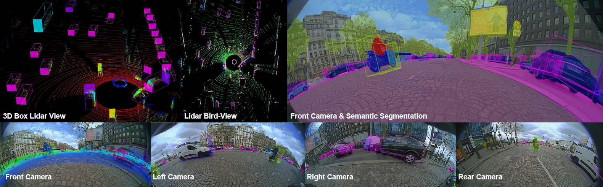

<<<<<<< HEAD
# WoodScape: A multi-task, multi-camera fisheye dataset for autonomous driving
The repository containing tools and information about the WoodScape dataset https://woodscape.valeo.com.

# [OmniDet: Surround View Cameras based Multi-task Visual Perception Network for Autonomous Driving](https://sites.google.com/view/omnidet/home)
The repository contains a [boilerplate code](omnidet) to encourage further research in building a unified perception model for autonomous driving.

<a href="https://youtu.be/xbSjZ5OfPes" target="_blank">

</a>

-----
**Update (Nov 16th, 2021):**
Weather dataset for classification has been uploaded [here](https://drive.google.com/drive/folders/1t3hwbPCfbokUaaWROr6PBA4WTW0GuQJi?usp=sharing)

**Update (Nov 8th, 2021):**
ChargePad dataset for object detection has been uploaded [here](https://drive.google.com/drive/folders/1KeLFIqOnhU2CGsD0vbiN9UqKmBSyHERd?usp=sharing)

**Update (May 20th, 2021):**
Scripts to generate dense polygon points for instanse segmentation are added. Precomputed boxes and polygon points (uniformly spaced) are now available for download [here](https://drive.google.com/drive/folders/1NKkQ25kh7pssKjnOUDjJd4GouyGRobIx)

**Update (April 15th, 2021):**
Calibration files (intrinsic and extrinsic parameters) are now available in our Google Drive ([link](https://drive.google.com/drive/folders/1X5JOMEfVlaXfdNy24P8VA-jMs0yzf_HR?usp=sharing)). 

Information on calibration process can be found [here](https://github.com/valeoai/WoodScape/blob/master/scripts/calibration/calibration_readme.txt)

**Update (March 5th, 2021):**
WoodScape paper was published at ICCV in November 2019 and we announced that the dataset was planned to be released in Q1 2020. Unfortunately, there were unexpected data protection policies required in order to comply with requirements for EU GDPR and Chinese data laws. Specifically, we had to remove one third of our dataset which was recorded in China and also employ a third party anonymization company for the remaining data. It was exacerbated by COVID situation and the subsequent economic downturn impacting the automotive sector. We apologize for the delay in the release by more than a year.

Finally, we have released the first set of tasks in our Google Drive ([link](https://drive.google.com/drive/folders/1X5JOMEfVlaXfdNy24P8VA-jMs0yzf_HR?usp=sharing)). It has 8.2K images along with their corresponding 8.2K previous images needed for geometric tasks. The remaining 1.8K test samples are held out for a benchmark. It currently has annotations for semantic segmentation, instance segmentation, motion segmentation and 2D bounding boxes. Soiling Detection and end-to-end driving prediction tasks will be released by March 15th, 2021. Sample scripts to use the data will be updated in the github shortly as well. Once this first set of tasks is complete and tested, additional tasks will be gradually added. The upcoming website will include an overview about the status of the additional tasks.

Despite the delay we still believe the dataset is unique in the field. Therefore we understand that this dataset has been long awaited by many researchers. We hope that an eco-system of research in multitask fisheye camera development will thrive based on this dataset. We will continue to bugfix, support and develop the dataset and therefore any feedback will be taken onboard.


## Demo
Please click on the image below for a teaser video showing annotated examples and sample results.

[](https://streamable.com/aiefb "")

## Dataset Contents

This dataset version consists of 10K images with annotations for 7 tasks. 
 * RGB images
 * Semantic segmentation
 * 2D bounding boxes
 * Instance segmentation
 * Motion segmentation 
 * Previous images
 * CAN information
 * Lens soiling data and annotations
 * Calibration Information
 * Dense polygon points for objects
 
Coming Soon: 
 * Fisheye sythetic data with semantic annotations
 * Lidar and dGPS scenes

## Data organization

```
woodscape
│   README.md    
│
└───rgb_images
│   │   00001_[CAM].png
│   │   00002_[CAM].png
|   |   ...
│   │
└───previous_images
│   │   00001_[CAM]_prev.png
│   │   00002_[CAM]_prev.png
|   |   ...
│   │
└───semantic_annotations
        │   rgbLabels
        │   │   00001_[CAM].png
        │   │   00002_[CAM].png
        |   |   ...
        │   gtLabels
        │   │   00001_[CAM].png
        │   │   00002_[CAM].png
        |   |   ...
│   │
└───box_2d_annotations
│   │   00001_[CAM].png
│   │   00002_[CAM].png
|   |   ...
│   │
└───instance_annotations
│   │   00001_[CAM].json
│   │   00002_[CAM].json
|   |   ...
│   │
└───motion_annotations
        │   rgbLabels
        │   │   00001_[CAM].png
        │   │   00002_[CAM].png
        |   |   ...
        │   gtLabels
        │   │   00001_[CAM].png
        │   │   00002_[CAM].png
        |   |   ...
│   │
└───vehicle_data
│   │   00001_[CAM].json
│   │   00002_[CAM].json
|   |   ...
│   │
│   │
└───calibration_data
│   │   00001_[CAM].json
│   │   00002_[CAM].json
|   |   ...
│   │
└───soiling_dataset
        │   rgb_images
        │   │   00001_[CAM].png
        │   │   00002_[CAM].png
        |   |   ...
        │   gt_labels
        │   │   00001_[CAM].png
        │   │   00002_[CAM].png
        |   |   ...
        │   gt_labels
        │   │   00001_[CAM].png
        │   │   00002_[CAM].png
        |   |   ...
```
[CAM] :

FV --> Front CAM

RV --> Rear CAM

MVL --> Mirror Left CAM

MVR --> Mirror Right CAM


## Annotation Information

* Instance annotations are provided for more than 40 classes as polygons in json format. 
  A full list of classes can be found in "/scripts/mappers/class_names.json"

* We provide semantic segmentation annotations for 10 classes: void, road, lanes, curbs, rider, person, vehicles, bicycle, motorcycle and traffic_sign. 
  You can generate the segmentation annotations for all the 40+ classes using the provided scripts.
  See the examples,
  For 3(+void) classes: "scripts/configs/semantic_mapping_3_classes.json"
  For 9(+void) classes: "scripts/configs/semantic_mapping_9_classes.json"  
  
* We provide 2D boxes for 5 classes: pedestrians, vehicles, bicycle, traffic lights and traffic sign. 
  You can generate the 2D boxes for 14+ classes using the provided scripts.
  See the example,
  For 5 classes: "scripts/configs/box_2d_mapping_5_classes.json" 
  * We also provide dense polygon points for the above 5 classes. These dense uniform points can be used for generating instanse masks.
 
* Motion annotations are available for 19 classes. 
  A full list of classes, indexes and colour coding can be found in motion_class_mapping.json


## Installation

Use the package manager [pip](https://pip.pypa.io/en/stable/) to install the required packages.

```bash
pip install numpy
pip install opencv-python
pip install tqdm
pip install shapely
pip install Pillow
pip install matplotlib
```
In windows shapely might raise polygon OSError: [WinError 126], use conda distribution as an alternative or install directly from .whl

## Usage

To generate segmenatic or 2D boxes or dense polygon points for more additional classes. Please use the following scripts

<span style="color:blue">semantic_map_generator.py</span>:
Generate the semantic segmentation annotations from json instance annotations 

```bash
python semantic_map_generator.py --src_path [DATASET DIR]/data/instance_annotations/ --dst_path [DATASET DIR]/data/semantic_annotations --semantic_class_mapping [DATASET DIR]/scripts/configs/semantic_mapping_9_classes.json --instance_class_mapping [DATASET DIR]/scripts/mappers/class_names.json
```

<span style="color:blue">box_2d_generator.py</span>:
Generates the 2D boxes from json instance annotations

```bash
python box_2d_generator.py --src_path [DATASET DIR]/data/instance_annotations/ --dst_path [DATASET DIR]/data/box_2d_annotations --box_2d_class_mapping [DATASET DIR]/scripts/configs/box_2d_mapping_5_classes.json --instance_class_mapping [DATASET DIR]/scripts/mappers/class_names.json --rgb_image_path [DATASET DIR]/data/rgb_images
```

<span style="color:blue">polygon_generator.py</span>:
Generates the dense polygon points from json instance annotations

```bash
python polygon_generator.py --src_path [DATASET DIR]/data/instance_annotations/ --dst_path [DATASET DIR]/data/polygon_annotations --box_2d_class_mapping [DATASET DIR]/scripts/configs/box_2d_mapping_5_classes.json --instance_class_mapping [DATASET DIR]/scripts/mappers/class_names.json --rgb_image_path [DATASET DIR]/data/rgb_images
```

## Contributing
Pull requests are welcome. For major changes, please open an issue first to discuss what you would like to change.

Please make sure to update tests as appropriate.

## License for the code
[MIT](https://choosealicense.com/licenses/mit/)

## License for the data
[Proprietary](https://drive.google.com/file/d/12IrLnGfng6s-NogJLIvUZsCxF1NDA-FA/view?usp=sharing)


## Paper
[WoodScape: A multi-task, multi-camera fisheye dataset for autonomous driving](https://arxiv.org/abs/1905.01489)  
Senthil Yogamani, Ciaran Hughes, Jonathan Horgan, Ganesh Sistu, Padraig Varley, Derek O'Dea, Michal Uricar, Stefan Milz, Martin Simon, Karl Amende, Christian Witt, Hazem Rashed, Sumanth Chennupati, Sanjaya Nayak, Saquib Mansoor, Xavier Perroton, Patrick Perez  
Valeo  
IEEE International Conference on Computer Vision (ICCV), 2019 (**Oral**)

If you find our dataset useful, please cite our [paper](https://arxiv.org/abs/1905.01489):

```
@article{yogamani2019woodscape,
  title={WoodScape: A multi-task, multi-camera fisheye dataset for autonomous driving},
  author={Yogamani, Senthil and Hughes, Ciar{\'a}n and Horgan, Jonathan and Sistu, Ganesh and Varley, Padraig and O'Dea, Derek and Uric{\'a}r, Michal and Milz, Stefan and Simon, Martin and Amende, Karl and others},
  journal={arXiv preprint arXiv:1905.01489},
  year={2019}
}
```
=======
HM reference software for HEVC
==============================

This software package is the reference software for Rec. ITU-T H.265 | ISO/IEC 23008-2 High Efficiency Video Coding (HEVC). The reference software includes both encoder and decoder functionality.

Reference software is useful in aiding users of a video coding standard to establish and test conformance and interoperability, and to educate users and demonstrate the capabilities of the standard. For these purposes, this software is provided as an aid for the study and implementation of Rec. ITU-T H.265 | ISO/IEC 23008-2 High Efficiency Video Coding.

The software has been jointly developed by the ITU-T Video Coding Experts Group (VCEG, Question 6 of ITU-T Study Group 16) and the ISO/IEC Moving Picture Experts Group (MPEG, Working Group 11 of Subcommittee 29 of ISO/IEC Joint Technical Committee 1).

The software is maintained by the Joint Video Experts Team (JVET) which is a joint collaboration of ITU-T Video Coding Experts Group (VCEG, Question 6 of ITU-T Study Group 16) and the ISO/IEC Moving Picture Experts Group (MPEG, Working Group 5 of Subcommittee 29 of ISO/IEC Joint Technical Committee 1).

A software manual, which contains usage instructions, can be found in the "doc" subdirectory of this software package.

Build instructions
==================

The CMake tool is used to create platform-specific build files. 

Although CMake may be able to generate 32-bit binaries, **it is generally suggested to build 64-bit binaries**. 32-bit binaries are not able to access more than 2GB of RAM, which will not be sufficient for coding larger image formats. Building in 32-bit environments is not tested and will not be supported.


Build instructions for plain CMake (suggested)
----------------------------------------------

**Note:** A working CMake installation is required for building the software.

CMake generates configuration files for the compiler environment/development environment on each platform. 
The following is a list of examples for Windows (MS Visual Studio), macOS (Xcode) and Linux (make).

Open a command prompt on your system and change into the root directory of this project.

Create a build directory in the root directory:
```bash
mkdir build 
```

Use one of the following CMake commands, based on your platform. Feel free to change the commands to satisfy
your needs.

**Windows Visual Studio 2015/17/19 64 Bit:**

Use the proper generator string for generating Visual Studio files, e.g. for VS 2015:

```bash
cd build
cmake .. -G "Visual Studio 14 2015 Win64"
```

Then open the generated solution file in MS Visual Studio.

For VS 2017 use "Visual Studio 15 2017 Win64", for VS 2019 use "Visual Studio 16 2019".

Visual Studio 2019 also allows you to open the CMake directory directly. Choose "File->Open->CMake" for this option.

**macOS Xcode:**

For generating an Xcode workspace type:
```bash
cd build
cmake .. -G "Xcode"
```
Then open the generated work space in Xcode.

For generating Makefiles with optional non-default compilers, use the following commands:

```bash
cd build
cmake .. -DCMAKE_BUILD_TYPE=Release -DCMAKE_C_COMPILER=gcc-9 -DCMAKE_CXX_COMPILER=g++-9
```
In this example the brew installed GCC 9 is used for a release build.

**Linux**

For generating Linux Release Makefile:
```bash
cd build
cmake .. -DCMAKE_BUILD_TYPE=Release
```
For generating Linux Debug Makefile:
```bash
cd build
cmake .. -DCMAKE_BUILD_TYPE=Debug
```

Then type
```bash
make -j
```

For more details, refer to the CMake documentation: https://cmake.org/cmake/help/latest/

Build instructions for make
---------------------------

**Note:** The build instructions in this section require the make tool and Python to be installed, which are
part of usual Linux and macOS environments. See below for installation instruction for Python and GnuWin32 
on Windows.

Open a command prompt on your system and change into the root directory of this project.

To use the default system compiler simply call:
```bash
make all
```


**MSYS2 and MinGW (Windows)**

**Note:** Build files for MSYS MinGW were added on request. The build platform is not regularily tested and can't be supported. 

Open an MSYS MinGW 64-Bit terminal and change into the root directory of this project.

Call:
```bash
make all toolset=gcc
```

The following tools need to be installed for MSYS2 and MinGW:

Download CMake: http://www.cmake.org/ and install it.

Python and GnuWin32 are not mandatory, but they simplify the build process for the user.

python:    https://www.python.org/downloads/release/python-371/

gnuwin32:  https://sourceforge.net/projects/getgnuwin32/files/getgnuwin32/0.6.30/GetGnuWin32-0.6.3.exe/download

To use MinGW, install MSYS2: http://repo.msys2.org/distrib/msys2-x86_64-latest.exe

Installation instructions: https://www.msys2.org/

Install the needed toolchains:
```bash
pacman -S --needed base-devel mingw-w64-i686-toolchain mingw-w64-x86_64-toolchain git subversion mingw-w64-i686-cmake mingw-w64-x86_64-cmake
```

>>>>>>> HM/master
